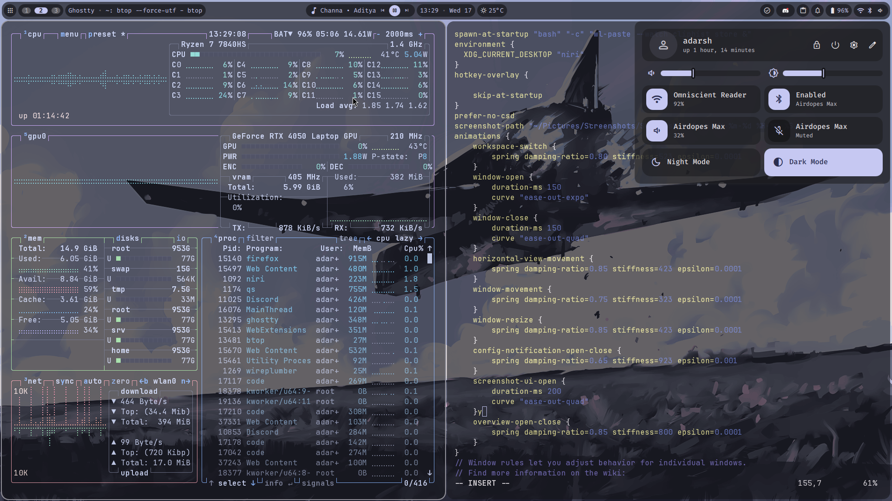
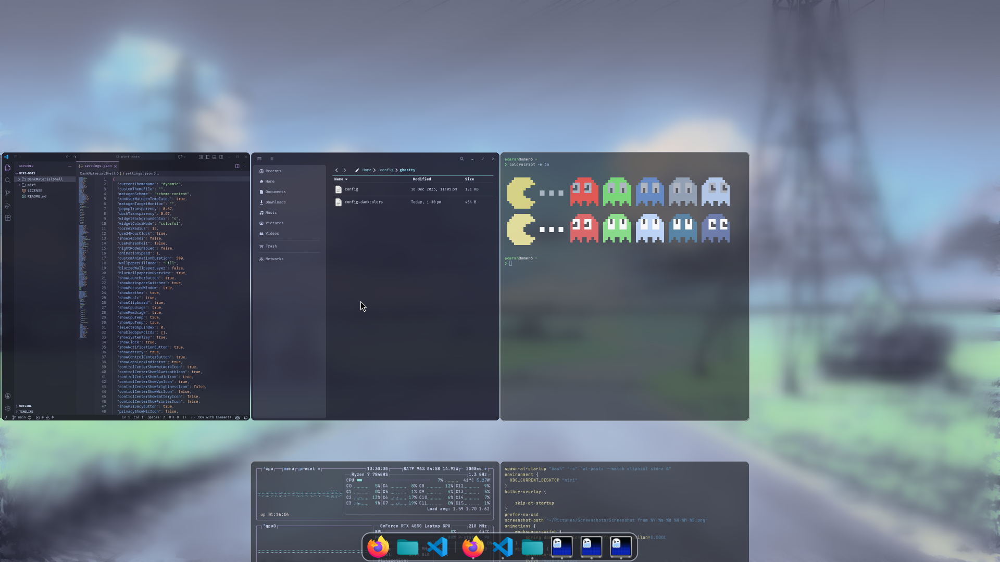
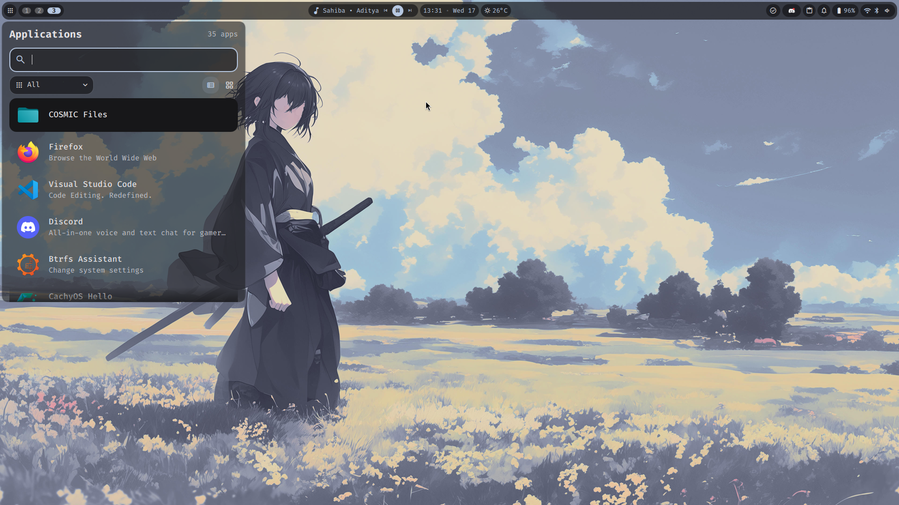
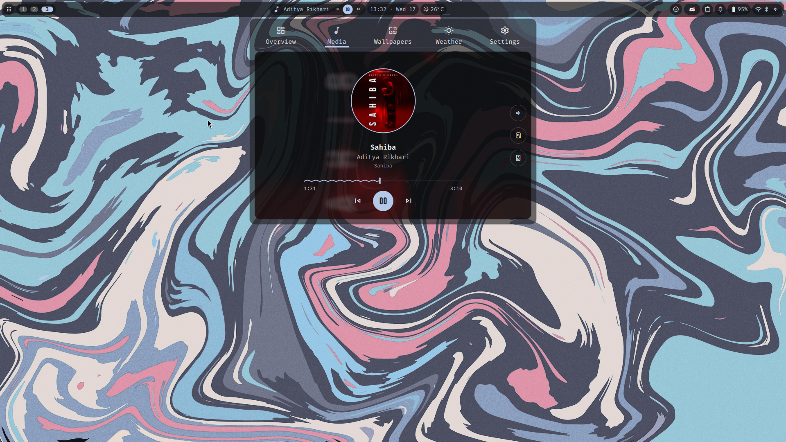
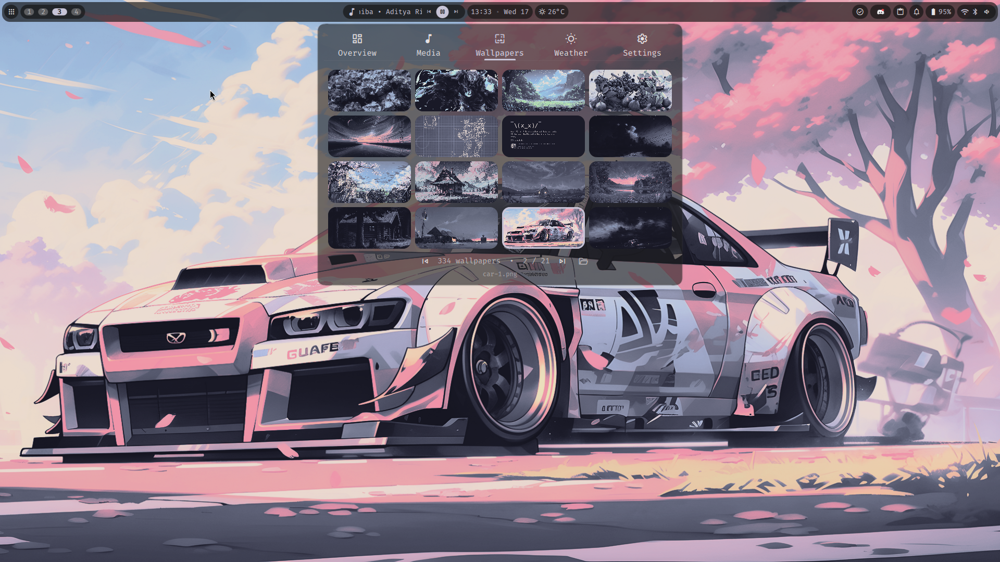

# niri-dots

My personal dotfiles for [niri](https://github.com/YaLTeR/niri) (a scrollable-tiling Wayland compositor) configured to work with [DankMaterialShell](https://github.com/AvengeMedia/DankMaterialShell).

## ⚠️ Prerequisites

**This configuration is intended to be used AFTER installing DankMaterialShell.**

Before using these dotfiles, make sure you have:
- [DankMaterialShell](https://github.com/AvengeMedia/DankMaterialShell) installed

## 📸 Screenshots

## 🙏 Credits

- [niri](https://github.com/YaLTeR/niri) by YaLTeR
- [DankMaterialShell](https://github.com/AvengeMedia/DankMaterialShell)
